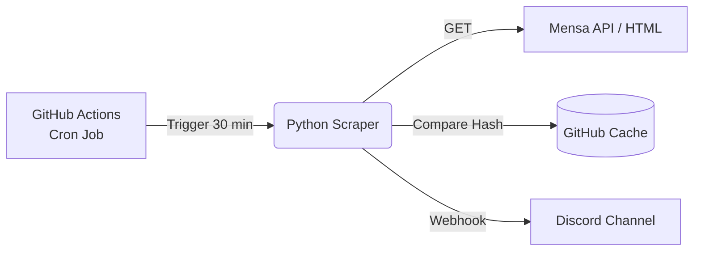

<div align="center">
  <h1>Mensa Discord Bot</h1>
  <p><strong>Campus Restaurant Culinaria</strong></p>
  
  [](https://www.python.org/)
  [](https://github.com/features/actions)
  [](https://opensource.org/licenses/MIT)

  <p>Ein automatisierter Web-Scraper und Discord-Bot, der den aktuellen Speiseplan der Campus-Mensa ueberwacht und Aenderungen in Echtzeit als Rich-Embed in einen Discord-Channel pusht.</p>
</div>

---

## Features

- **Automatisches Scraping**: Ueberwacht dynamisch die WordPress/AJAX-Endpoints der Mensa-Website.
- **Smart Update Detection**: Integriertes State-Management via `SHA256`-Hashing. Postet nur, wenn sich der Speiseplan oder die Angebote wirklich geaendert haben.
- **Rich Discord Embeds**: 
  - Farbcodierte Darstellung je nach Hauptgericht.
  - Automatische Erkennung von veganen und vegetarischen Optionen.
  - Extraktion von Preisen (Studierende / Gaeste) und Inhaltsstoffen.
- **Angebots-Tracking**: Erfasst neben den Tagesgerichten auch Aktions-Banner und die "Angebote der Woche" (Currywurst, Pasta, Pizza).
- **Serverless Architecture**: 100% kostenloser Betrieb durch GitHub Actions. Kein eigener Server (VPS/RasPi) notwendig.

## Architektur

Der Bot besteht aus einem in Python geschriebenen Web-Scraper (`BeautifulSoup4`), der per **Cron-Job** ueber GitHub Actions ausgefuehrt wird.



---

## Setup & Deployment (Fuer deinen eigenen Server)

Moechtest du diesen Bot fuer deine Fachschaft oder deinen Kommilitonen-Server nutzen? Der Bot ist Open-Source und in 5 Minuten einsatzbereit!

### 1. Repository Forken / Klonen
Erstelle einen [Fork](https://github.com/Maximilian1907/mensa-discord-bot/fork) dieses Repositories auf deinem eigenen GitHub-Account.

### 2. Discord Webhook erstellen
1. Gehe in deinem Discord-Server auf **Servereinstellungen** -> **Integrationen** -> **Webhooks**.
2. Erstelle einen neuen Webhook, nenne ihn z. B. `Mensa Bot` und waehle den Ziel-Channel aus.
3. Kopiere die Webhook-URL.

### 3. GitHub Secrets konfigurieren
1. Gehe in deinem geforkten Repository auf **Settings** -> **Secrets and variables** -> **Actions**.
2. Klicke auf **New repository secret**.
3. Name: `DISCORD_WEBHOOK_URL`
4. Secret: *Fuege hier deine Discord Webhook-URL ein*.

Das war's! Der Bot laeuft nun vollautomatisch im Hintergrund.

---

## Lokale Entwicklung

Falls du den Bot anpassen oder erweitern moechtest:

```bash
# Repository klonen
git clone https://github.com/Maximilian1907/mensa-discord-bot.git
cd mensa-discord-bot

# Virtuelles Environment erstellen & aktivieren (empfohlen)
python -m venv venv
source venv/bin/activate  # Linux/Mac
# venv\Scripts\activate   # Windows

# Abhaengigkeiten installieren
pip install -r requirements.txt

# Test-Modus ausfuehren (Gibt JSON & Vorschau im Terminal aus, sendet NICHTS an Discord)
python scrape_mensa.py --test

# Mit echtem Webhook testen
export DISCORD_WEBHOOK_URL="https://discord.com/api/webhooks/..."
python scrape_mensa.py --force
```

### CLI Argumente

| Flag | Beschreibung |
|---|---|
| `--test` | Dry-Run Modus. Speichert keinen State, sendet keine Requests an Discord. |
| `--force` | Ignoriert den Hash-Check und postet den Plan zwingend neu. |
| `--check-current` | Prueft die "Aktuelle Woche" anstelle der "Naechsten Woche". |

---

## Laufzeiten & GitHub Actions

Der Bot ist so vorkonfiguriert, dass er **alle 30 Minuten zwischen 06:00 und 18:00 Uhr deutscher Zeit** laeuft (`*/30 4-16 * * *` in UTC). Dies stellt sicher, dass alle Updates erfasst werden, minimiert aber gleichzeitig den Verbrauch von GitHub Actions Freiminuten (verbraucht ca. ~700 von 2.000 monatlichen Freiminuten im Free-Tier).

## Lizenz

Dieses Projekt steht unter der **MIT License** - siehe die [LICENSE](LICENSE) Datei fuer Details. Feel free to use, modify and distribute!
